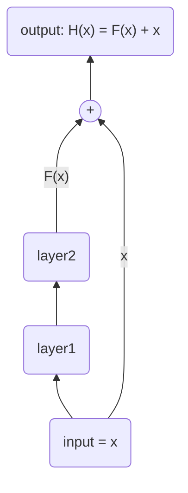

[toc]

## ResNet50

深度学习中，随着网络层数的增加，发现网络出现了退化的现象，即随着网络的层数增加，训练集的 loss 逐渐下降，然后趋于饱和，再接着增加网络深度的话，训练集的 loss 反而会增大。

ResNet（残差网络） 通过调整网络的结构来解决这个问题。网络发生退化现象，说明浅层网络能够达到比深层网络更好的训练效果。那么就可以直接把靠近输入的神经网络层直接短接到靠近输出的层。



如果输入 $x$ 经过两个神经网络层的变换后结果是 $F(x)$，同时将输入直接短接到两层之后，那最后这个包含两层网络的神经网络模块输出为 $H(x)=F(x)+x$。那么这两层网络 layer1 和 layer2 就被设计成只需要拟合输入 $x$ 与目标输出 $H(x)$ 的残差。这样即使多加了这两层也不会使模型效果变差，因为 $x$ 被直接短接到了两层之后，相当于学了一个恒等映射，跳过的这两层只需要拟合上层输出和目标之间的残差即可。

### ResNet50 的网络结构

==两种残差块==

#### identity_block


输入与输出维度一致。

#### conv_block


输入与输出维度不一致，不能直接将输入加到输出上，所以在短路上使用了一个卷积层用来调整输入的维度。

#### 整个网络的结构


(在浏览器打开这个图片可能会清楚一些)

一共五个 stage：

stage1 结构比较简单，可看作是对 Input 的预处理；

stage2 ，1个conv_block + 2个identity_block；

stage3 ，1个conv_block + 3个identity_block；

stage4 ，1个conv_block + 5个identity_block；

stage5，1个conv_block + 2个identity_block；

最后输出部分：全局平均池化层+全连接+softmax激活函数。

全局平均池化层主要是为了降低参数的数量，从最后一个残差块出来的张量形状为 (7, 7, 2048)，直接全连接参数个数为 $7*7*2048*class\_num$ ；全局平均池化后再全连接，参数个数为 $2048*class\_num$ 。

在 `./models/resnet50.py` 文件中，在靠近输出的部分（最后一个残差块出来之后）

```python
    x = AveragePooling2D((7, 7), name='avg_pool')(x)  # -> (1, 1, 2048)

    if include_top:
        x = Flatten()(x)  # -> (None, 2048)
        x = Dense(classes, activation='softmax', name='fc1000')(x)
    else:
        if pooling == 'avg':
            x = GlobalAveragePooling2D()(x)  # -> (2048,)
        elif pooling == 'max':
            x = GlobalMaxPooling2D()(x)
```

这里 `x = AveragePooling2D((7, 7), name='avg_pool')(x)` ，由于最后一个残差块出来是 (7, 7, 2048)，`AveragePooling2D` 的参数`pool_size=(7,7)` ，`padding` 是默认的 `'valid'` ，得到的结果和用 `GlobalAveragePooling2D` 的区别应该就是维度不同了，平均池化是 (1,1,2048)，全局平均池化是 (2048,) ，所以如果 `include_top=True` 要再接一个 `Flatten` 变成长度为 2048 的向量。如果 `include_top=False` 可以自己添加网络层的时候 ，`./train.py` 的 `add_custom_top_layer` 函数中，`x = GlobalAveragePooling2D(name='avg_pooling')(x)` 输出形状为 (2048,) 不用再 `Flatten` 。

## 垃圾分类

### 项目文件结构

```bash
├── environment.yml  环境配置
├── environment_win.yml
├── garbage.md  一些说明和笔记
├── garbage_classify_v2
│   ├── garbage_classify_rule.json  分类规则
│   └── train_data_v2  图片数据集
├── models
│   ├── elephant.jpg  ResNet50 测试图片
│   └── resnet50.py  ResNet50 网络的代码
├── output
│   └── best.h5  保存的训练后模型的参数
├── predict.py  预测
├── requirements.txt  项目依赖
├── requirements_win.txt
├── server.py  Flask 服务部署
├── static  静态文件文件夹
│   ├── images
│   └── main.css
├── templates  渲染模板文件夹
│   ├── index.html
│   ├── layout.html
│   └── predict.html
├── tools
│   ├── cust_utils.py  自定义工具
│   ├── cutout.py  cutout  方法
│   └── garbage_sequence.py  批量获取数据（一些数据处理和图像增强）
└── train.py  模型训练
```

### 运行

**windows**

使用 `Anaconda` 或 `miniconda`

1. 在 Anaconda Prompt 里导航到项目文件夹下，运行`conda env create -f environment_win.yml`，创建一个新的环境。如果下载速度很慢，可以给 `conda` [配置国内镜像源](https://blog.csdn.net/weixin_44055306/article/details/121174336)。

   

2. 使用文本编辑器或者 IDE 打开 `garbage` 项目文件，选择 `garbage` 环境下的 python 解释器。

3. 运行 `resnet50.py` 文件

4. 运行 `train.py` 文件，训练模型。有 3000 张图片，9:1 划分的训练集和验证集。

   

5. 运行 `predict.py` 文件，可以进行预测。

   

6. 运行 `server.py` ，在本地部署服务。

   

   点击地址或在浏览器导航栏输入地址，可以看到实时视频流：

   

   点击拍照，会以 `alert` 弹窗的形式返回预测结果。

   

M1

命令行 `conda env create -f environment.yml` 其它一样。

**其他**

更建议在运行前把 `/models/weights/` 下的两个文件放到 `C:/Users/{username}/.keras/models/` 文件夹下，把 `resnet50.py` 里的这一段给删了。


windows 下运行 `predict.py`，如果开的有本地代理软件，要关掉。不然如果输入的是图片的 URL 的时候，会报错 `Caused by SSLError(SSLEOFError...)`


## 其他

**数据集**

数据集一共有差不多 15000 张图片，这里随机抽选了 3000 张图片训练网络。如果 3000 张多了或者少了，可以使用下面的代码重新抽选。

```
├── train_data_v2  包含全部图片的文件夹
└── sample.py
```

```python
# sample.py
import os, random, shutil
from glob import glob
import re
import codecs

def sample(tar_dir: str, num: int) -> None:
    if not os.path.exists(tar_dir):
        os.mkdir(tar_dir)
        
    label_files = glob(os.path.join('./train_data_v2/', '*.txt'))
    picked_label_files = random.sample(label_files, num)
    img_file_paths = []
    tar_img_paths = []
    
    for idx, label_file_path in enumerate(picked_label_files):
        with codecs.open(label_file_path, 'r', encoding='utf-8') as f:
            line = f.readline()
        line_split = line.strip().split(', ')
        img_name = line_split[0]
        img_file_paths.append(os.path.join('./train_data_v2/', img_name))
        tar_img_paths.append(os.path.join(tar_dir, img_name))
        
    tar_label_paths = []
    for i in picked_label_files:
        new_path = re.sub('train_data_v2', tar_dir, i)
        tar_label_paths.append(new_path)
        
    for i in range(num):
        shutil.copyfile(img_file_paths[i], tar_img_paths[i])
        shutil.copyfile(picked_label_files[i], tar_label_paths[i])
        
        
if __name__ == '__main__':
    sample('result3000', 3000)
```


